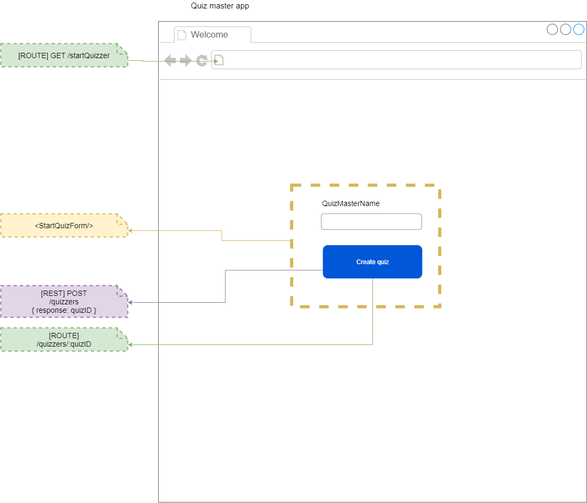
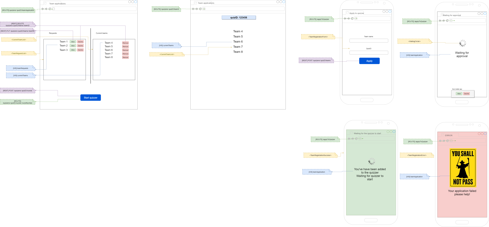
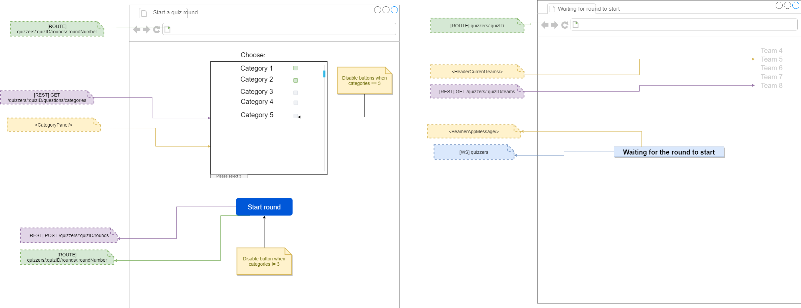
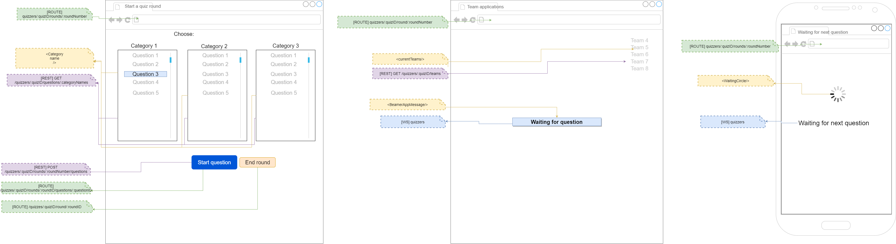
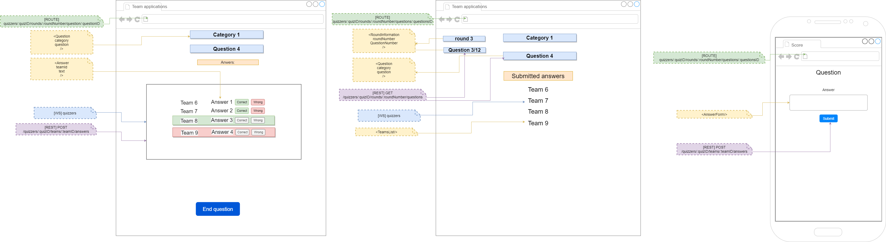
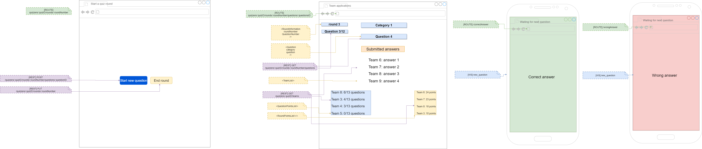
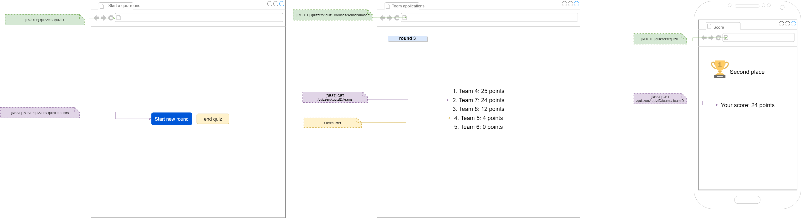
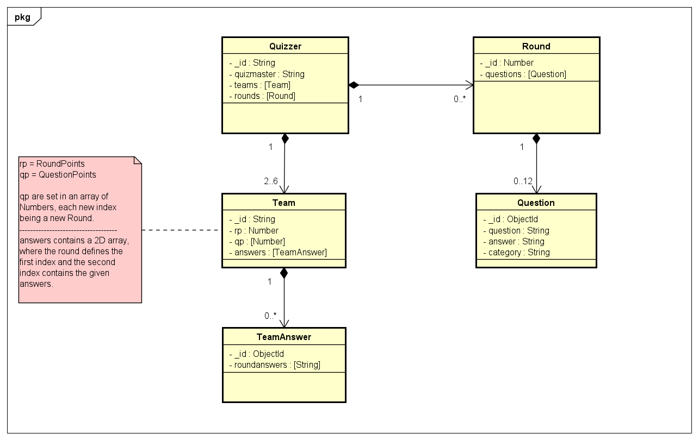
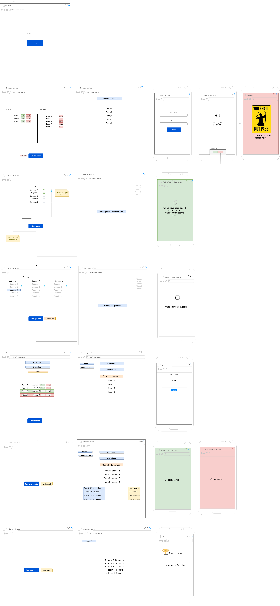

# Quizzer Assignment
_By: Douwe Brouwer (605015) & Wout Hakvoort (603046)_
_Course: DWA-Semester - Blok 1_

## Table of Contents
1. [Software Guidebook](#1-Software-Guidebook)
    1. [Wireframes, Resources and User Interaction](#11-Wireframes,-Resources-and-User-Interaction)
    2. [Communication Protocols](#12-Communication-Protocols)
    3. [WebSocket Messages](#13-WebSocket-Messages)
    4. [Data Storage Design](#14-Data-Storage-Design)
    5. [Client State Design](#15-Client-State-Design)
    6. [Webserver Structure Design](#16-Webserver-Structure-Design)
2. [Appendix](#2-Appendix)
    1. [Appendix A Wireframe app](#21-Appendix-A-Wireframe-Quizzer-total)

---

## 1. Software Guidebook
### 1.1. Wireframes, Resources and User Interaction
_Introduction_

This paragraph contains the wireframes, resources and user interactions from the following three applications:
1. Quizmaster application
2. Team application
3. Scoreboard appliocation

The wireframes show the basic layout from the application and give the reader an idea
of how the application might look when it's finished. The resources show which components are contained in a wireframe.
For each component the states are noted aswell. The wireframes, resources and user interactions are subtracted into different
parts. These parts are the following:
* Starting a Quizzer
* Joining a Quizzer
* Starting a Quizzer Round
* Selecting a Quizzer Question
* During a Quizzer Question
* Closing a Quizzer Question
* Finishing a Quizzer

##### Wireframes:
_Note: see appendix A for the wireframe of the entire application_
<br>

_Starting a Quizzer_

<br>

_Joining a Quizzer_

<br>

_Starting a Quizzer Round_

<br>

_Selecting a Quizzer Question_

<br>

_During a Quizzer Question_

<br>

_Closing a Quizzer Question_

<br>

_Finishing a Quizzer_



---
### 1.2. REST-API
_Introduction_

This paragraph gives an explanation about the REST-API for the WebServer.

_REST-API_

The REST-API documentation is created using Swagger.IO. This is a handy tool to create API-documentation. The API can be found in the
documentation folder. The [API_Documentation](./documentation/api_documentation)-directory contains several files which come in handy to
view the API documentation. Firstly, the [README.md](./documentation/api_documentation/README.md) gives an explanation on how to use scripts
which are used to generate the API documentation. The [view_doc](./documentation/api_documentation/view_doc)-directory contains a HTML-page
which show the API documentation. This document can be used to read the specifications from the API.

Besides the HTML-page, there is a script which can be run to update the API-documentation based on the [api_doc-swagger.yaml](./documentation/api_documentation/api_doc-swagger.yaml)-file.
The HTML-page inside the view_doc-directory will automatically be updated to it's newest version.

---
### 1.3. WebSocket Messages
_Introduction_

This paragraph contains the specification for each WebSocket Message.

#### WebServer > Quizmaster Application

The QM_TEAM_APPLICATION message will let the Quizmaster know if a new team has applied to the quiz.
This will result in a GET-request to the webserver which retrieves all the teams.

```json
{
  type: QM_TEAM_APPLICATION
}
```
<br>
The QM_ANSWER_SUBMITTED message will notify the Quizmaster that a team has submitted an answer. This will
result in a GET-request to the webserver to retrieve the answers from a team. A Quizmaster can then approve or disapprove an answer.


```json
{
  type: QM_ANSWER_SUBMITTED
}
```
<br>

#### WebServer > Scoreboard Application
The SB_APPLICATION_ACCEPTED message will let the Scoreboard application know if a new team has been allowed to take part in the Quizzer.
This will result in a GET-request to the webserver which retrieves all allowed teams. To retrieve only the accepted teams, there will be made use of a query parameter.

```json
{
  type: SB_APPLICATION_ACCEPTED
}
```
<br>

The SB_APPLICATION_DONE message will let the Scoreboard application know that the team application part is done. This will result in a waiting 
screen on the Scoreboard application.

```json
{
  type: SB_APPLICATION_DONE
}
```
<br>

The SB_ROUND_STARTED message will notify the Scoreboard application that a round has started.

```json
{
  type: SB_ROUND_STARTED
}
```
<br>

The SB_QUESTION_STARTED message will notify the Scoreboard application that a question has been selected by the Quizmaster.
This will result in some requests to retrieve the question and category information. This information will be shown.

```json
{
  type: SB_QUESTION_STARTED
}
```
<br>

The SB_ANSWER_SUBMITTED message will notify the Scoreboard application that a certain team has given an answer.
This will result in a GET-request to the teams and answers collection. If a team has given an answer, this will be shown on the
scoreboard. The answer will not been shown.

```json
{
  type: SB_ANSWER_SUBMITTED
}
```
<br>

The SB_QUESTION_ENDED message notifies the Scoreboard application that the Quizmaster has ended a question. This will result in the
Scoreboard application retrieving the current question scores (number of correct answered questions vs. total number of questions) from the teams. The scores will be shown on the Scoreboard application.

```json
{
  type: SB_QUESTION_ENDED
}
```
<br>

The SB_ROUND_ENDED message notifies the Scoreboard application that the Quizmaster has ended a round. This will result in the
Scoreboard application retrieving the current round points from the teams. The scores will be shown on the Scoreboard application.

```json
{
  type: SB_ROUND_ENDED
}
```
<br>

#### WebServer > Teams Application

The APPLICATION_ACCEPTED message will let a team know that they're allowed to take part in the quiz.
Based on this message the SPA Teams Application will show a green screen to the user. 

```json
{
  type: TM_APPLICATION_ACCEPTED
}
```
<br>

The APPLICATION_REJECTED message will let a team know they're rejected for a certain quiz. This will result in a red screen.
When this is the case, the user will have a link available to apply again to a quiz.

```json
{
  type: TM_APPLICATION_REJECTED
}
```
<br>

The TM_APPLICATION_DONE message will let the Team application know that the team application part is done. This will result in a waiting 
screen on the Team application.

```json
{
  type: TM_APPLICATION_DONE
}
```
<br>

The TM_ROUND_STARTED message will notify the Team application that a round has started.

```json
{
  type: TM_ROUND_STARTED
}
```
<br>

The TM_QUESTION_STARTED message will notify the Team application that a question has been selected by the Quizmaster.
This will result in the application showing a form, where the team can give their answer to the question.

```json
{
  type: TM_QUESTION_STARTED
}
```
<br>

The TM_QUESTION_ENDED message notifies a team that the current question has ended. This will result in the "waiting for next question"-screen.

```json
{
  type: TM_QUESTION_ENDED
}
```
<br>

The TM_ROUND_ENDED message notifies a team that the current question has ended. This will result in the waiting for next round screen.

```json
{
  type: TM_ROUND_ENDED
}
```
<br>

----

### 1.4. Data Storage Design
_Introduction_

This paragraph contains information about which data is stored in MongoDB and what the structure is
from this data. Because the Quizzer contains a variety of components, it's important that the data is stored correctly and efficiently. 

The paragraph is divided into two parts: 

1. High-Level Data Overview
2. Mongoose Schema's

_High-Level Data Overview_
This part contains a Model to show the relations between components and to show which data is stored inside a component.




_Mongoose Schemas_
This part contains the Mongoose Schemas/Models which will be used in the webserver-application to store the Quizzer data.

```js
const mongoose = require('mongoose');

const TeamAnswer = new mongoose.Schema(
  {
    roundanswers: [String]
  }
);

const Team = new mongoose.Schema(
  {
    _id: {
      type: String,
      required: true
    },
    rp: Number,
    qp: [Number],
    answers: [TeamAnswers]
  }
);

const Round = (
  {
    _id: {
      type: Number,
      required: true
    },
    questions: [Question]
  }
);

const Question = new mongoose.Schema(
  {
    question: {
      type: String,
      required: true
    },
    answer: {
      type: String,
      required: true
    },
    category: {
      type: String,
      required: true
    }
  }
);

const Quizzer = new mongoose.Schema(
  {
    _id: {
      type: String,
      required: true
    },
    quizmaster: {
      type: String,
      required: true
    },
    teams: [Team],
    questions: [Question]
  }
);

const QuizzerModel = new mongoose.model("Quizzer", l_QuizzerSchema);
```
---
### 1.5. Client State Design
_Introduction_

This paragraph contains information about the basic components. The components are based on the
wireframes which were created in paragraph 1.1.

Beneath the components are listed. This is an initial list and can be adjusted later on. Some
components contain store variables. Some components make use from the Redux Store using Reducers.

Custom react components:

##### QuizMaster App
- StartQuiz
  - StartQuizForm
- TeamApplication
  - CurrentTeamList
    - _**Store:** Current team names_
  - TeamRequestList
      - _**Store:** Applied team names_
- CreateRound
  - CategoryPanel
    - _**Store:** Categories_
- ChooseQuestion
  - QuestionList
    - _**Store:** Questions_
- WhileQuestion
  - Question
    - _**Store:** Questions_
  - AnswerList
    - Answer
      - _**Store:** Questions, team names, answers_
- EndQuestion
- EndRound

----

##### Scoreboard App
- TeamApplication
  - CurrentTeamList
    - _**Store:** Current team names_
- CreateRound
  - HeaderCurrentTeams
    - _**Store:** Current team names_
  - BeamerAppMessage
- ChooseQuestion
  - CurrentTeams
    - _**Store:** Current team names_
- WhileQuestion
  - RoundInformation
    - _**Store:** Roundnumber, Questionnumber_
  - Question
    - _**Store:** Question_
  - TeamList
    - _**Store:** Current team names_
- EndQuestion
  - RoundInformation
    - _**Store:** Roundnumber, Questionnumber_
  - Question
    - _**Store:** Question_
  - TeamList
    - _**Store:** Current team names_
  - QuestionPointsList
    - _**Store:** Team names, Questionpoints_
  - RoundPointsList
    - _**Store:** Team names, Roundpoints_
- EndRound
  - TeamList
    - _**Store:** Current team names, Totalpoints, Roundpoints_


----

##### Team App
- TeamApplication
  - TeamRegistrationForm
  - TeamRegistrationSuccess
  - TeamRegistrationError
  - WaitingCircle
- ChooseQuestion
  - WaitingCircle
- WhileQuestion
  - _**Store:** Question_
  - AnswerForm
- EndQuestion
  - CorrectAnswer
  - WrongAnswer
- EndRound
  - _**Store:** Totalpoints, Roundpoints_

----

### 1.6. Webserver Structure Design
_Introduction_

This paragraph describes the structure from the webserver. The webserver will contain several components:
* Websocket connections
* Routers
* Middleware

Beneath some of these parts will be described.
<br>

_WebSockets_

The WebServer will have WebSockets for the communication to:
* A QuizMaster application
* A Scoreboard application
* Each team

The WebSocket messages which will be used in the Quizzer application are specified in [paragraph 1.3 - WebSocket Messages](#13-WebSocket-Messages).
<br>

_Routers_
The webserver contains 3 routers:
* Teams: Used for all information about teams for example: current team names and their scores
* Questions: Used for all information about questions for example: question, answers and their category.
* Quiz: Used for all in-game stats for example: Questionnumber, roundnumber and the quizmaster name.
<br>

_Middleware_
This application uses 3 middleware functionalties:
* Errorhandler: For errorhandling.
* Bodyparser: For parsing the body.
* Logger (optional): A general logger which logs all the incoming requests. This can be used for testing purpose.

---

# 2. Appendix
# 2.1. Appendix A Wireframe Quizzer total


_Quizzer total_